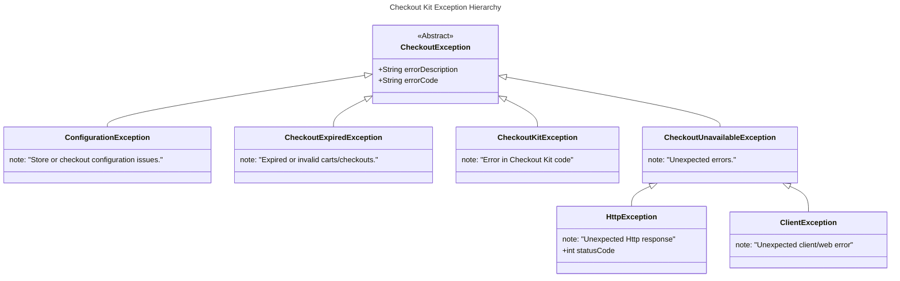

# Shopify Checkout Kit - Android

[](/LICENSE)

[]()


**Shopify's Checkout Kit for Android** is a library that enables Android apps to provide the world's highest converting, customizable, one-page checkout within an app. The presented experience is a fully-featured checkout that preserves all of the store customizations: Checkout UI extensions, Functions, and more. It also provides idiomatic defaults such as support for light and dark mode, and convenient developer APIs to embed, customize and follow the lifecycle of the checkout experience. Check out our developer blog to [learn how Checkout Kit is built](https://www.shopify.com/partners/blog/mobile-checkout-sdks-for-ios-and-android).

**Note**: This library was previously published as `com.shopify:checkout-sheet-kit`. It has been renamed to `com.shopify:checkout-kit`. Update your Gradle/Maven dependency if upgrading from an older version.

- [Requirements](#requirements)
- [Getting Started](#getting-started)
  - [Gradle](#gradle)
  - [Maven](#maven)
- [Basic Usage](#basic-usage)
- [Configuration](#configuration)
  - [Color Scheme](#color-scheme)
  - [Log Level](#log-level)
  - [Checkout Dialog Title](#checkout-dialog-title)
- [Monitoring the lifecycle of a checkout session](#monitoring-the-lifecycle-of-a-checkout-session)
  - [Error handling](#error-handling)
    - [`CheckoutException`](#checkoutexception)
    - [Exception Hierarchy](#exception-hierarchy)
- [Integrating identity \& customer accounts](#integrating-identity--customer-accounts)
  - [Cart: buyer bag, identity, and preferences](#cart-buyer-bag-identity-and-preferences)
  - [Multipass](#multipass)
  - [Shop Pay](#shop-pay)
  - [Customer Account API](#customer-account-api)
- [Contributing](#contributing)
- [License](#license)

## Requirements

- JDK 17+
- Android minSdk 23+
- Android compileSdk 35+
- Chrome >= 80

## Getting Started

The SDK is an [open source Android library](https://central.sonatype.com/artifact/com.shopify/checkout-kit). As a quick start, see
[sample projects](samples/README.md) or use one of the following ways to integrate the SDK into
your project:

### Gradle

```groovy
implementation "com.shopify:checkout-kit:1.0.0-alpha.1"
```

### Maven

```xml

<dependency>
   <groupId>com.shopify</groupId>
   <artifactId>checkout-kit</artifactId>
   <version>1.0.0-alpha.1</version>
</dependency>
```

## Basic Usage

Once the SDK has been added as a dependency, you can import the library:

```kotlin
import com.shopify.checkoutkit.ShopifyCheckoutKit
```

To present a checkout to the buyer, your application must first obtain a checkout URL.
The most common way is to use the [Storefront GraphQL API](https://shopify.dev/docs/api/storefront)
to assemble a cart (via `cartCreate` and related update mutations) and load the
[`checkoutUrl`](https://shopify.dev/docs/api/storefront/latest/objects/Cart#field-cart-checkouturl). Alternatively, a [cart permalink](https://help.shopify.com/en/manual/products/details/cart-permalink) can be provided.
You can use any GraphQL client to obtain a checkout URL and we recommend
Shopify's [Mobile Buy SDK for Android](https://github.com/Shopify/mobile-buy-sdk-android) to
simplify the development workflow:

```kotlin

val client = GraphClient.build(
    context = applicationContext,
    shopDomain = "yourshop.myshopify.com",
    accessToken = "<storefront access token>"
)

val cartQuery = Storefront.query { query ->
    query.cart(ID(id)) {
        it.checkoutUrl()
    }
}

client.queryGraph(cartQuery).enqueue {
    if (it is GraphCallResult.Success) {
        val checkoutUrl = it.response.data?.cart?.checkoutUrl
    }
}
```

The `checkoutUrl` object is a standard web checkout URL that can be opened in any browser.
To present a native checkout dialog in your Android application, provide
the `checkoutUrl` alongside optional runtime configuration settings to the `present(checkoutUrl)`
function provided by the SDK:

```kotlin
fun presentCheckout() {
    val checkoutUrl = cart.checkoutUrl
    ShopifyCheckoutKit.present(checkoutUrl, context) {
        onFail { error ->
            handleCheckoutError(error)
        }
        onCancel {
            resetCheckoutUi()
        }
    }
}
```

> [!NOTE]
> Pass the standard `checkoutUrl` returned by Storefront API or a cart permalink.
> Checkout Kit adds the required UCP query parameters automatically when it loads checkout,
> so you do not need to rewrite the URL yourself.

If you also want typed Embedded Checkout Protocol (ECP) callbacks, connect a
`CheckoutProtocol.Client` inside the same Kotlin builder:

```kotlin
val checkoutProtocolClient = CheckoutProtocol.Client()
    .on(CheckoutProtocol.start) { checkout ->
        // Checkout is ready and interactive.
    }
    .on(CheckoutProtocol.complete) { checkout ->
        // Typed checkout payload emitted when checkout completes.
        navigateToConfirmation(checkout)
    }

ShopifyCheckoutKit.present(checkoutUrl, activity) {
    connect(checkoutProtocolClient)
}
```

## Configuration

The SDK provides a way to customize the presented checkout experience via
the `ShopifyCheckoutKit.configure` function.

### Color Scheme

By default, the SDK will match the user's device color appearance. This behavior can be customized
via the `colorScheme` property:

```kotlin
ShopifyCheckoutKit.configure {
    // [Default] Automatically toggle idiomatic light and dark themes based on device preference.
    it.colorScheme = ColorScheme.Automatic()

    // Force idiomatic light color scheme
    it.colorScheme = ColorScheme.Light()

    // Force idiomatic dark color scheme
    it.colorScheme = ColorScheme.Dark()

    // Force web theme, as rendered by a mobile browser
    it.colorScheme = ColorScheme.Web()

    // Force web theme, passing colors for the modal header and background
    it.colorScheme = ColorScheme.Web(
        Colors(
            webViewBackground = Color.ResourceId(R.color.web_view_background),
            headerFont = Color.ResourceId(R.color.header_font),
            headerBackground = Color.ResourceId(R.color.header_background),
            progressIndicator = Color.ResourceId(R.color.progress_indicator),
        )
    )
}
```

> [!Tip]
> Colors can also be specified in sRGB format (e.g. `Color.SRGB(-0xff0001)`) and can also be overridden for Light/Dark/Automatic themes, (see example below)

```kotlin
val automatic = ColorScheme.Automatic(
    lightColors = Colors(
        headerBackground = Color.ResourceId(R.color.headerLight),
        headerFont = Color.ResourceId(R.color.headerFontLight),
        webViewBackground = Color.ResourceId(R.color.webViewBgLight),
        progressIndicator = Color.ResourceId(R.color.indicatorLight),
    ),
    darkColors = Colors(
        headerBackground = Color.ResourceId(R.color.headerDark),
        headerFont = Color.ResourceId(R.color.headerFontDark,
        webViewBackground = Color.ResourceId(R.color.webViewBgDark),
        progressIndicator = Color.ResourceId(R.color.indicatorDark),
    )
)
```

**Close Icon Customization**

The close icon in the checkout dialog header can be customized using the `customize` method for an ergonomic API:

```kotlin
ShopifyCheckoutKit.configure {
    it.colorScheme = ColorScheme.Light().customize {
        // Option 1: Just tint the default close icon
        closeIconTint = Color.ResourceId(R.color.my_custom_tint_color)

        // Option 2: Use a completely custom drawable
        closeIcon = DrawableResource(R.drawable.my_custom_close_icon)
    }
}
```

For automatic theme switching, you can provide different customizations for light and dark modes:

```kotlin
ShopifyCheckoutKit.configure {
    it.colorScheme = ColorScheme.Automatic().customize(
        light = {
            closeIconTint = Color.ResourceId(R.color.light_tint)
        },
        dark = {
            closeIconTint = Color.ResourceId(R.color.dark_tint)
        }
    )
}
```

> [!Note]
> If both `closeIcon` and `closeIconTint` are provided, the custom drawable (`closeIcon`) takes precedence and the tint is ignored.

The colors that can be modified are:

- headerBackground - Used to customize the background of the app bar on the dialog,
- headerFont - Used to customize the font color of the header text within in the app bar,
- webViewBackground - Used to customize the background color of the WebView,
- progressIndicator - Used to customize the color of the progress indicator shown when checkout is loading.
- closeIcon - Used to provide a completely custom close icon drawable
- closeIconTint - Used to tint the default close icon with a custom color

The current configuration can be obtained by calling `ShopifyCheckoutKit.getConfiguration()`.

### Log Level

Enable additional debug logs via the `logLevel` configuration option.

```kotlin
ShopifyCheckoutKit.configure {
    it.logLevel = LogLevel.DEBUG
}
```

### Checkout Dialog Title

To customize the title of the Dialog that the checkout WebView is displayed within, or to provide different values for the various locales your app supports, override the `checkout_web_view_title` String resource in your application, e.g:

```xml
<string name="checkout_web_view_title">Buy Now!</string>
```

## Monitoring the lifecycle of a checkout session

For Kotlin integrations, use `CheckoutProtocol.Client` to observe typed checkout notifications
such as `ec.start`, `ec.complete`, and the incremental checkout state updates. The same
`present(...)` builder can wire fail/cancel callbacks plus optional browser/system hooks:

```kotlin
ShopifyCheckoutKit.present(checkoutUrl, activity) {
    connect(
        CheckoutProtocol.Client()
            .on(CheckoutProtocol.start) { checkout ->
                // Observe typed checkout notifications.
            }
            .on(CheckoutProtocol.complete) { checkout ->
                // Handle successful checkout completion.
            }
    )

    onShowFileChooser { webView, filePathCallback, fileChooserParams ->
        // Return true if the host app handled the chooser request.
        false
    }

    onGeolocationPermissionsShowPrompt { origin, callback ->
        // Called to tell the client to show a geolocation permissions prompt as a geolocation
        // request has been made. Invoked for example if a customer uses `Use my location`
        // for pickup points.
    }

    onGeolocationPermissionsHidePrompt {
        // Called to tell the client to hide the geolocation permissions prompt.
    }

    onPermissionRequest { permissionRequest ->
        // Called when a web permission has been requested, e.g. to access the camera.
    }
}
```

If you prefer a reusable object, or are integrating from Java, extend
`DefaultCheckoutListener` and pass it to the existing `present(...)` overload:

```kotlin
val listener = object : DefaultCheckoutListener() {
    override fun onShowFileChooser(
        webView: WebView,
        filePathCallback: ValueCallback<Array<Uri>>,
        fileChooserParams: FileChooserParams,
    ): Boolean {
        return activity.onShowFileChooser(filePathCallback, fileChooserParams)
    }

    override fun onGeolocationPermissionsShowPrompt(origin: String, callback: GeolocationPermissions.Callback) {
        activity.onGeolocationPermissionsShowPrompt(origin, callback)
    }

    override fun onGeolocationPermissionsHidePrompt() {
        activity.onGeolocationPermissionsHidePrompt()
    }

    override fun onPermissionRequest(permissionRequest: PermissionRequest) {
        // Grant, deny, or proxy requested web permissions.
    }
}

ShopifyCheckoutKit.present(checkoutUrl, context, listener)
```

> [!Note]
> The `DefaultCheckoutListener` overload remains available for reusable or Java-facing
> integrations and provides default implementations for optional browser/system callbacks.

### Error handling

Checkout failures are delivered to `onFail { ... }` or `onCheckoutFailed(...)` as
`CheckoutException` values. Inspect the exception type and error code to decide whether to
recreate the cart, retry later, or show an error state in the host app.

#### `CheckoutException`

| Exception Class                | Error Code                     | Description                                                                  | Recommendation                                                                              |
| ------------------------------ | ------------------------------ | ---------------------------------------------------------------------------- | ------------------------------------------------------------------------------------------- |
| `ConfigurationException`       | 'storefront_password_required' | Access to checkout is password protected.                                    | We are working on ways to enable the Checkout Kit for usage with password protected stores. |
| `ConfigurationException`       | 'unknown'                      | Other configuration issue, see error details for more info.                  | Resolve the configuration issue in the error message.                                       |
| `CheckoutExpiredException`     | 'cart_expired'                 | The cart or checkout is no longer available.                                 | Create a new cart and open a new checkout URL.                                              |
| `CheckoutExpiredException`     | 'cart_completed'               | The cart associated with the checkout has completed checkout.                | Create new cart and open a new checkout URL.                                                |
| `CheckoutExpiredException`     | 'invalid_cart'                 | The cart associated with the checkout is invalid (e.g. empty).               | Create a new cart and open a new checkout URL.                                              |
| `CheckoutKitException`    | 'error_receiving_message'      | Checkout Kit failed to receive a message from checkout.                      | Handle as a checkout failure in the host app.                                               |
| `CheckoutKitException`    | 'error_sending_message'        | Checkout Kit failed to send a message to checkout.                           | Handle as a checkout failure in the host app.                                               |
| `CheckoutKitException`    | 'render_process_gone'          | The render process for the checkout WebView is gone.                         | Handle as a checkout failure in the host app.                                               |
| `CheckoutKitException`    | 'unknown'                      | An error in Checkout Kit has occurred, see error details for more info.      | Handle as a checkout failure in the host app.                                               |
| `HttpException`                | 'http_error'                   | An unexpected server error has been encountered.                             | Handle as a checkout failure in the host app.                                               |
| `ClientException`              | 'client_error'                 | An unhandled client error was encountered.                                   | Handle as a checkout failure in the host app.                                               |
| `CheckoutUnavailableException` | 'unknown'                      | Checkout is unavailable for another reason, see error details for more info. | Handle as a checkout failure in the host app.                                               |

#### Exception Hierarchy



## Integrating identity & customer accounts

Buyer-aware checkout experience reduces friction and increases conversion. Depending on the context
of the buyer (guest or signed-in), knowledge of buyer preferences, or account/identity system, the
application can use one of the following methods to initialize personalized and contextualized buyer
experience.

### Cart: buyer bag, identity, and preferences

In addition to specifying the line items, the Cart can include buyer identity (name, email, address,
etc.), and delivery and payment preferences:
see [guide](https://shopify.dev/docs/custom-storefronts/building-with-the-storefront-api/cart/manage).
Included information will be used to present pre-filled and pre-selected choices to the buyer within
checkout.

### Multipass

[Shopify Plus](https://help.shopify.com/en/manual/intro-to-shopify/pricing-plans/plans-features/shopify-plus-plan)
merchants
using [Classic Customer Accounts](https://help.shopify.com/en/manual/customers/customer-accounts/classic-customer-accounts)
can use [Multipass](https://shopify.dev/docs/api/multipass) to integrate an external identity system
and initialize a buyer-aware checkout session.

```json
{
  "email": "<Customer's email address>",
  "created_at": "<Current timestamp in ISO8601 encoding>",
  "remote_ip": "<Client IP address>",
  "return_to": "<Checkout URL obtained from Storefront API>",
  ...
}
```

1. Follow the [Multipass documentation](https://shopify.dev/docs/api/multipass) to create a
   multipass
   URL and set the `'return_to'` to be the obtained `checkoutUrl`
2. Provide the Multipass URL to `ShopifyCheckoutKit.present()`.

> [!Important]
> the above JSON omits useful customer attributes that should be provided where possible and
> encryption and signing should be done server-side to ensure Multipass keys are kept secret.

### Shop Pay

To initialize accelerated Shop Pay checkout, the cart can set a
[walletPreference](https://shopify.dev/docs/api/storefront/latest/mutations/cartBuyerIdentityUpdate#field-cartbuyeridentityinput-walletpreferences)
to 'shop_pay'. The sign-in state of the buyer is app-local and the buyer will be prompted to sign in
to their Shop account on their first checkout, and their sign-in state will be remembered for future
checkout sessions.

### Customer Account API

The Customer Account API allows you to authenticate buyers and provide a personalized checkout experience.
For detailed implementation instructions, see our [Customer Account API Authentication Guide](https://shopify.dev/docs/storefronts/headless/mobile-apps/checkout-kit/authenticate-checkouts).

---

## Contributing

We welcome code contributions, feature requests, and reporting of issues. Please
see [guidelines and instructions](.github/CONTRIBUTING.md).

## License

Shopify's Checkout Kit is provided under an [MIT License](LICENSE).
